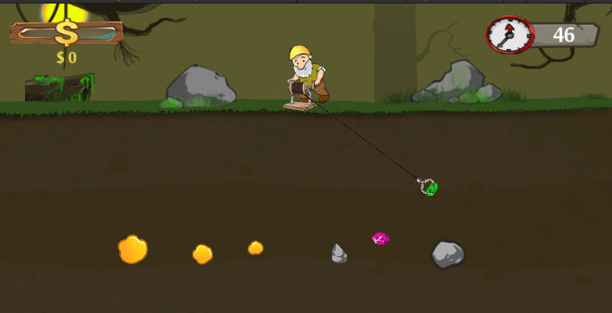
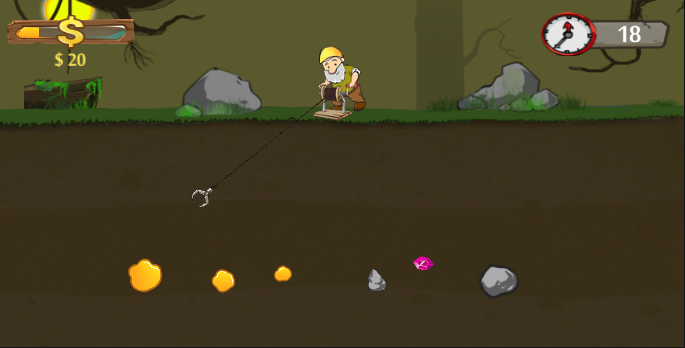
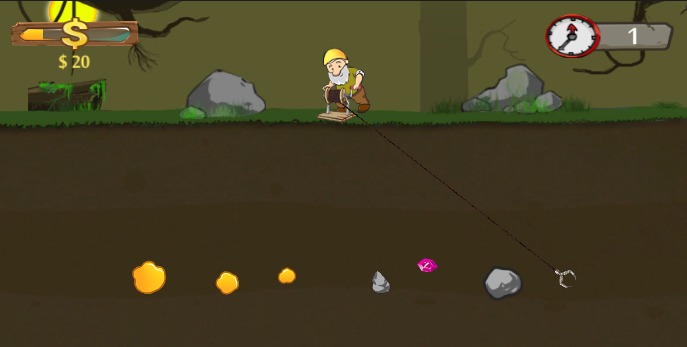

# Game-2-Gold-Miner-2D
Game Gold Miner 2D ini saya buat dengan mengikuti beberapa latihan cara membuat game di youtube dan beberapa course yang saya temukan. Setelah mengumpulkan beberapa vidio untuk latihan pemrograman bahasa C# saya mencoba untuk mengimplemntasikan dan menjadikan sebuah game. Dari situ lah game Gold Miner 2D ini saya coba buat dengan mengikuti tutorial

Game Gold Miner adalah game yang dimana pemain harus mencapit sebuah gold di dalamnya. Jadi nantinya pemain akan mencari sebuah gold untuk di tarik ke atas permukaan. Pemain di berikan sebuah capit, dan capitnya nanti akan dijadikan untuk mengambil sebuah gold dan beberapa barang lainnya yang ada di bawah tanah. Ketika pemain berhasil menempatkan capit ke benda yang ada di bawah tanah maka pemain bisa mengambil barang tersebut dan barang tersebut akan masuk kedalam perhitunngan uang yang di dapat pemain. Untuk cara menjalankan capitnya sendiri yaitu pemain tinggal mengfokuskan pandangan mereka ke benda yang akan di tarik, ketika capit bergerak meewati benda nya maka pemain tinggal melakukan klik pada mouse maka capit akan otomatis kebawah mencapit bendanya.

Untuk link download project game nya bisa di download disini(karena tidak bisa di upload ke github karena cukup besar) : 
https://drive.google.com/file/d/1AlgvHrzWgYW5NIILbSH__TVXR6UY1O_r/view?usp=sharing

Untuk gambaran gamenya kurang lebih seperti di bawah 
 
 

